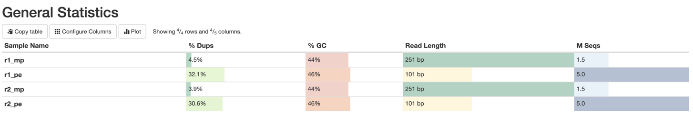
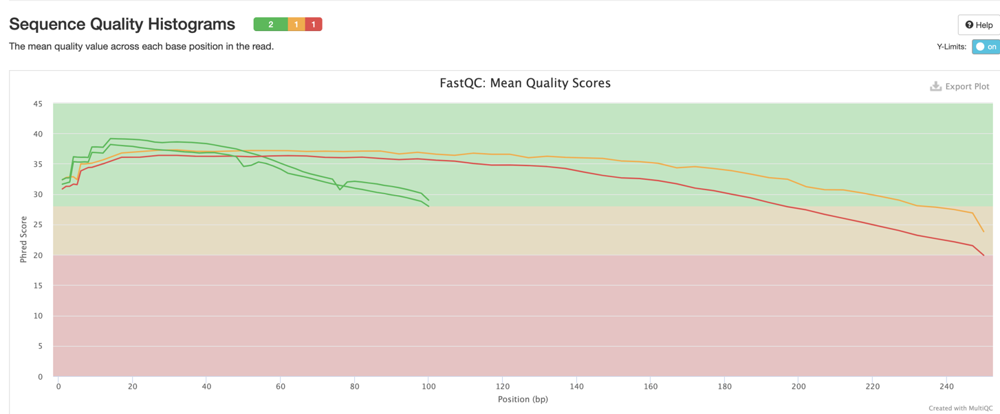
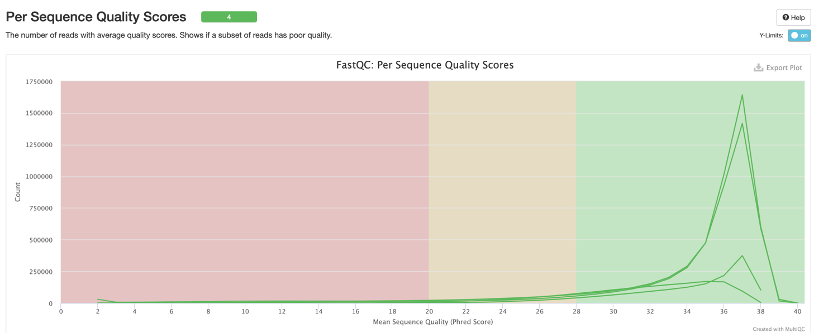
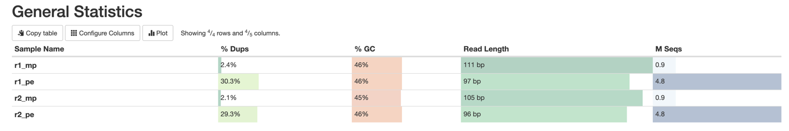
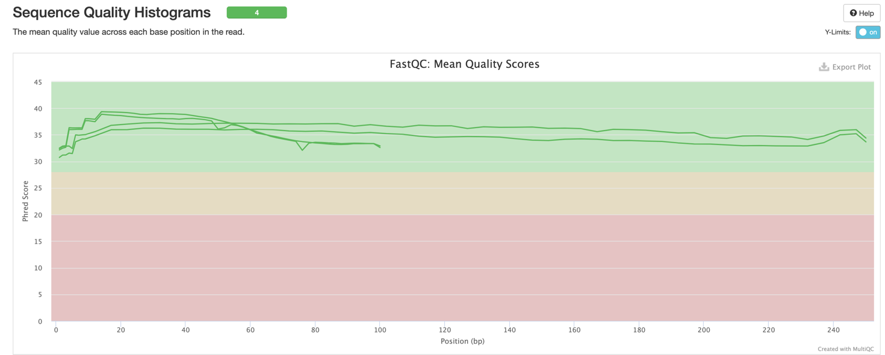
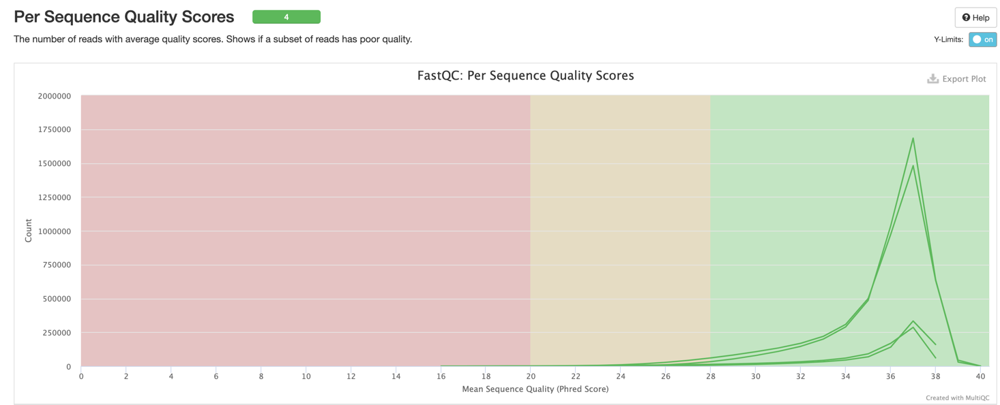

# hse22_hw1

Отбираем 5 миллионов paired_end и  1.5 миллиона mate-pairs чтений
```
seqtk sample -s 503 oil_R1.fastq 5000000 > r1_pe.fastq
seqtk sample -s 503 oil_R2.fastq 5000000 > r2_pe.fastq
seqtk sample -s 503 oilMP_S4_L001_R1_001.fastq 1500000 > r1_mp.fastq
seqtk sample -s 503 oilMP_S4_L001_R2_001.fastq 1500000 > r2_mp.fastq
```

Для получения статистики используем fastQC и multiQC
```
mkdir fastqc_res
fastqc r1_pe.fastq r2_pe.fastq r1_mp.fastq r2_mp.fastq -o fastqc_res
mkdir multiqc_res
multiqc -o multiqc_res fastqc_res
```





Подрезаем чтения по качеству
```
platanus_trim r1_pe.fastq r2_pe.fastq
platanus_internal_trim r1_mp.fastq r2_mp.fastq
```

Удаляем исходные файлы
```
rm *.fastq
```

Получаем статистику
```
mkdir trimmed_res
fastqc r1_pe.fastq.trimmed r1_mp.fastq.int_trimmed r2_pe.fastq.trimmed r2_mp.fastq.int_trimmed -o trimmed_res
mkdir multi_trimmed_res
multiqc -o multi_trimmed_res trimmed_res
```





По приведенным выше данным видно, что скор увеличился

Получаем контиги
```
platanus assemble -f r1_pe.fastq.trimmed r2_pe.fastq.trimmed 
```

Собираем скаффолды
```
platanus scaffold -c out_contig.fa -IP1 r1_pe.fastq.trimmed r2_pe.fastq.trimmed -OP2 r1_mp.fastq.int_trimmed r2_mp.fastq.int_trimmed
```

Уменьшаем количество гэпов
```
platanus gap_close -c out_scaffold.fa -IP1 r1_pe.fastq.trimmed r2_pe.fastq.trimmed -OP2 r1_mp.fastq.int_trimmed r2_mp.fastq.int_trimmed
```

Возьмем 10% от предыдущего объема данных и повторим те же операции

```
seqtk sample -s 503 oil_R1.fastq 500000 > r1_pe_small.fastq
seqtk sample -s 503 oil_R2.fastq 500000 > r2_pe_small.fastq
seqtk sample -s 503 oilMP_S4_L001_R1_001.fastq 150000 > r1_mp_small.fastq
seqtk sample -s 503 oilMP_S4_L001_R2_001.fastq 150000 > r2_mp_small.fastq

mkdir fastqc_res_small
fastqc r1_pe_small.fastq r2_pe_small.fastq r1_mp_small.fastq r2_mp_small.fastq -o fastqc_res_small
mkdir multiqc_res_small
multiqc -o multiqc_res_small fastqc_res_small

platanus_trim r1_pe_small.fastq r2_pe_small.fastq
platanus_internal_trim r1_mp_small.fastq r2_mp_small.fastq

rm *.fastq

mkdir trimmed_res_small
fastqc r1_pe_small.fastq.trimmed r1_mp_small.fastq.int_trimmed r2_pe_small.fastq.trimmed r2_mp_small.fastq.int_trimmed -o trimmed_res_small
mkdir multi_trimmed_res_small
multiqc -o multi_trimmed_res_small trimmed_res_small

platanus assemble -f r1_pe_small.fastq.trimmed r2_pe_small.fastq.trimmed -o small
platanus scaffold -c small_contig.fa -IP1 r1_pe_small.fastq.trimmed r2_pe_small.fastq.trimmed -OP2 r1_mp_small.fastq.int_trimmed r2_mp_small.fastq.int_trimmed -o small
platanus gap_close -c small_scaffold.fa -IP1 r1_pe_small.fastq.trimmed r2_pe_small.fastq.trimmed -OP2 r1_mp_small.fastq.int_trimmed r2_mp_small.fastq.int_trimmed -o small
```

Увеличились суммарная длина и количество гэпов + скаффолдов стало больше